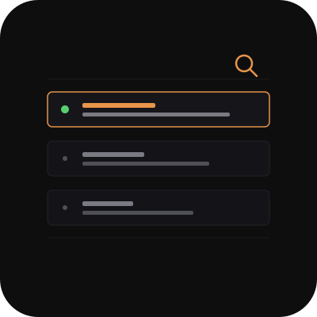

<div align="center">



# cc-session-browser

[](https://www.python.org/)
[](https://fastapi.tiangolo.com/)
[](LICENSE)
[](https://www.inkandswitch.com/local-first/)
[]()
[]()
[](CONTRIBUTING.md)
[](https://github.com/RichardLitt/standard-readme)

A local web UI to search, browse, and resume **Claude Code** sessions across all
projects on a single dev machine.

</div>

## Table of Contents

- [Background](#background)
- [Features](#features)
- [Architecture](#architecture)
- [Install](#install)
- [Usage](#usage)
- [Configure](#configure)
- [Run as a systemd service](#run-as-a-systemd-service)
- [Security](#security)
- [Contributing](#contributing)
- [License](#license)

## Background

Claude Code stores every session as a JSONL transcript on disk
(`~/.claude/projects/<encoded-cwd>/<sid>.jsonl`). After a few weeks of daily
use you end up with hundreds of them, scattered across project directories,
and the built-in `claude --resume` picker only shows the most recent few per
project. Finding *that one session from last Tuesday where I was debugging
the auth flow* becomes the limiting factor.

`cc-session-browser` is a single-machine, no-build-step web UI that reads
those transcripts directly and gives you full-text search, date-grouped
browsing, and one-click resume. Inspired by Raycast's precision retrieval
and a photographer's contact sheet — designed for *recognition under partial
memory* when you've got hundreds of past sessions and need to find the right
one to resume.

> Reads `~/.claude/history.jsonl` and `~/.claude/projects/<encoded-cwd>/<sid>.jsonl`
> directly from disk. Nothing leaves your machine — purely local.

## Features

- **Search-first**: a Raycast-shaped hero search box that scopes against topic,
  project name, or full transcript text (optional `--full` flag). Debounced,
  highlight-on-match.
- **Date-grouped contact sheet**: sessions cluster under `Today`, `Yesterday`,
  `Wed Apr 30`, etc. Sticky group headers, scan many sessions fast.
- **Persistent detail pane** (desktop): click a row → right-hand pane shows the
  initial prompt + the last assistant output + a copy-pasteable resume command.
  Mobile (≤900px) collapses to a slide-in drawer.
- **Per-field copy buttons**: resume command, project path, and session ID
  each have their own copy button. Falls back to `execCommand('copy')` when
  the page is served over plain HTTP (LAN, Tailscale) where
  `navigator.clipboard` is unavailable.
- **Real activity sort**: orders by transcript file mtime (catches resumes,
  tool calls, autonomous work) — not just last user-message timestamp.
- **Live indicator**: green `●` for any session whose transcript was modified in
  the last 60 seconds.
- **Infinite scroll**: 50 sessions per page, IntersectionObserver loads more as
  you scroll. Handles 500+ session archives without lag.
- **URL state**: every filter + search term lands in the URL. Share a search
  result link from desktop to phone over Tailscale.
- **Filter chips**: today / this week / long (>30min) / errored (transcript has
  tool errors) / **stale** (see below) / full-text search.
- **Project detection**: the detail pane shows which projects a session
  actually worked on, derived from the *files edited* (not the launch dir).
  Sessions that span 3-5 projects show all of them. Configurable via
  `PROJECT_PARENTS` so it works for `apps/`, `Projects/`, `code/`, etc.
- **Staleness analyzer**: flags sessions worth removing — older than 60d,
  abandoned (<5 prompts AND >30d old), or whose project directory has been
  deleted. Renamed projects can be mapped via `PROJECT_RENAMES` so they
  don't trigger false positives.
- **Archive (not delete)**: a two-step-confirm button moves a session
  transcript to `~/.claude/projects/_archive/<sid>.jsonl` with a
  `.meta.json` sidecar so it can be restored. `history.jsonl` is rewritten
  with a `.bak` for safety.
- **Mobile-first responsive**: 16px inputs (no iOS zoom), 44px tap targets,
  works great over Tailscale from a phone.

## Architecture

| File | Responsibility |
|---|---|
| `server.py` | FastAPI app — reads `~/.claude/`, exposes `/api/sessions`, `/api/session/<sid>`, `POST /api/session/<sid>/archive` |
| `static/index.html` | minimal shell — markup only, no logic |
| `static/app.css` | All design tokens + layout (Field.io-inspired dark theme) |
| `static/app.js` | `Api` (data) · `Store` (state) · `View` (DOM) · `App` (controller) — strict SOLID separation |
| `examples/cc-session-browser.service` | reference systemd unit (LAN + Tailscale binding) |

## Install

Requires Python 3.11+. Tested on Debian 13.

```bash
git clone https://github.com/Joncik91/cc-session-browser.git
cd cc-session-browser
python3 -m venv .venv
source .venv/bin/activate
pip install -r requirements.txt
```

## Usage

```bash
# Defaults: bind 127.0.0.1:8766, CORS allows loopback only
.venv/bin/uvicorn server:app --host 127.0.0.1 --port 8766
```

Open `http://127.0.0.1:8766/` in your browser. The search box autofocuses on
desktop; start typing to filter sessions across all projects on this machine.

Click any row to open the detail pane. Use the **copy** buttons to grab the
resume command, project path, or session ID. The resume command takes the
form `cd <project> && claude --resume <sid>`.

## Configure

All configuration is via environment variables — there is no config file.
Sensible defaults mean most users only need `ALLOWED_ORIGINS`.

| Var | Default | Purpose |
|---|---|---|
| `ALLOWED_ORIGINS` | `http://127.0.0.1:8766,http://localhost:8766` | Comma-separated CORS allowlist. Add your LAN/Tailscale URLs to access from phone or other devices. |
| `PROJECT_PARENTS` | `apps,Projects,projects,code,src,repos` | Which parent dir names to bucket projects under. The basename right after one of these counts as a project. |
| `PROJECT_ROOTS` | `$HOME` | Where to look for project directories when checking existence (used by the staleness analyzer to detect deleted projects). Comma-separated absolute paths. |
| `PROJECT_RENAMES` | (unset) | JSON map of old project names → new ones, so transcripts that reference renamed projects credit the surviving name. Use `null` to mark a project as deleted: `{"old":"new","gone":null}`. |

Example for LAN + Tailscale access:

```bash
ALLOWED_ORIGINS="http://127.0.0.1:8766,http://192.168.1.10:8766,http://100.64.0.5:8766" \
  uvicorn server:app --host 0.0.0.0 --port 8766
```

Example with project-name overrides (e.g. running as root with projects
under both `/root/apps` and `/home/you/Projects`, and one project renamed):

```bash
PROJECT_ROOTS="/root,/home/you" \
PROJECT_RENAMES='{"old-name":"new-name","aaOS":null}' \
  uvicorn server:app --host 127.0.0.1 --port 8766
```

## Run as a systemd service

See `examples/cc-session-browser.service`. Copy to `/etc/systemd/system/`,
edit paths + env vars, then:

```bash
sudo systemctl daemon-reload
sudo systemctl enable --now cc-session-browser
```

## Security

**Do not expose this to the public internet.** Your transcripts contain every
prompt you've ever sent Claude — code, secrets, personal context. Bind to
loopback or LAN only, or hide it behind Tailscale / WireGuard.

The default config binds to `127.0.0.1` for this reason. Switching to
`--host 0.0.0.0` requires explicit intent — make sure your firewall scopes the
port to trusted networks.

## Contributing

PRs welcome. See [CONTRIBUTING.md](CONTRIBUTING.md) — the codebase is
intentionally small (no build step, single-file frontend, stdlib + FastAPI),
which means the design philosophy matters more than usual.

This README follows the [Standard README](https://github.com/RichardLitt/standard-readme)
specification.

## License

MIT © Joncik91. See [LICENSE](LICENSE).
